#  HW3  Blackjack

**Name:** 林均豪  
**Student ID:** 111550005  

---

# 1. Overview
This project implements a standard Blackjack game in a web browser using **HTML**, **CSS**, and **JavaScript**.  
The goal is to achieve a hand value closer to 21 than the dealer without exceeding 21.

## 遊戲主畫面（Game UI Overview）

下圖為遊戲運作期間的主要 UI 介面，包含玩家手牌、莊家手牌、下注區與操作按鈕。

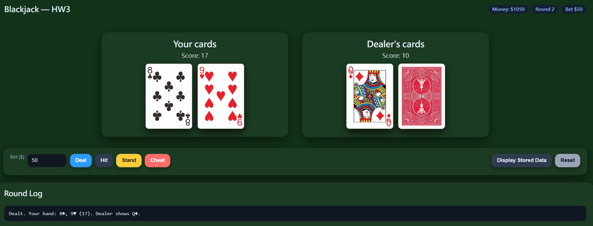
---

# 2. Deck & Card Handling
The game uses a standard **52‑card deck**.

### Cards:
- **Ranks:** A, 2–10, J, Q, K  
- **Suits:** ♣ ♦ ♥ ♠  

### Implementation:
- Deck built programmatically using nested loops.
- Shuffled with the **Fisher–Yates algorithm**.
- Cards are drawn using `pop()`, ensuring:
  - No duplicates
  - Random distribution
  - Correct remaining deck size

This satisfies the assignment requirement for proper deck construction and card flow.

---

# 3. Blackjack Rules (Required)

## 3.1 Start of a Round

## 遊戲啟動畫面

玩家進入遊戲時會顯示提示，提醒必須先下注再按 Deal。

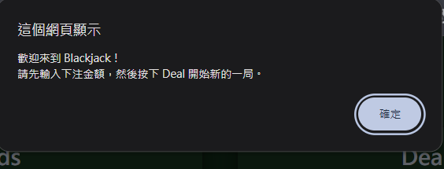
1. Player enters **bet amount**.  
2. Clicks **Deal**.  
3. Both sides receive 2 cards:
   - Player sees both.
   - Dealer shows 1 and hides 1.

## 3.2 Player Actions


### **Hit**
Draws one more card.  
If total > 21 → **Immediate bust (lose)**.

## Hit（抽牌）示意圖

玩家按下 Hit 時會抽取一張新牌，若點數超過 21 則爆牌 (Bust)。

### 玩家 Hit 後的手牌
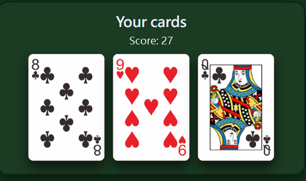

### Hit 生成的 Round Log
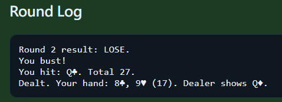

### **Stand**
Ends player's turn, dealer begins playing.

## Stand（停止抽牌）示意圖

當玩家按下 Stand 時，玩家不再抽牌，
改由 莊家（Dealer）開始補牌，直到至少 17 點為止
之後雙方比點數決定勝負。

### 玩家按下 Stand 後的牌局狀態
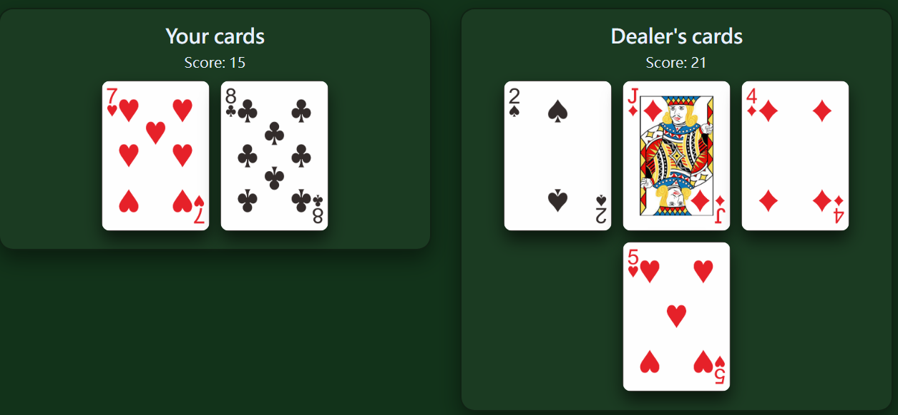

### Stand 生成的 Round Log
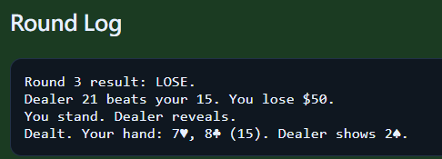

## 3.3 Dealer Rules (Mandatory)
Dealer follows the rules:

- Dealer **must Hit** while total < 17  
- Dealer **must Stand** when total ≥ 17  
 
**“Dealer must stand on 17 or above.”**

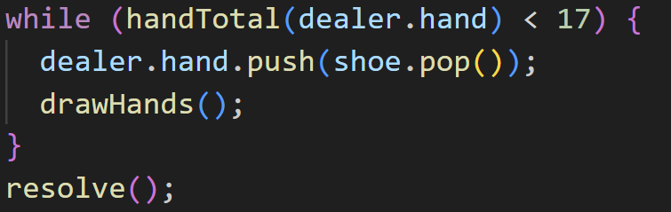

## 3.4 Round Result
- Player bust → dealer wins  
- Dealer bust → player wins  
- Neither bust:
  - Higher total wins  
  - Same total → Push (tie)  

---

# 4. Hand Value Calculation

### Card Values:
- 2–10 → rank value  
- J / Q / K → 10  
- A (Ace) → **11 or 1**, whichever best avoids busting  

The program automatically converts Aces (11 → 1) when necessary.

---

# 5. Betting System

- Player starts with **$1000**  
- Player must enter a bet before clicking Deal  
- After each round:
  - **Win → +bet**
  - **Lose → –bet**
  - **Push → no change**

If money becomes **0 or lower**, the game enters **Game Over** and player must Reset.

---

# 6. Defensive Checks (Validation)

The game includes robust 防呆機制 to prevent invalid actions.

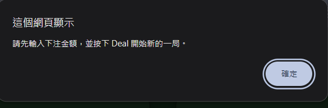

### ✔ Before round starts:
- Hit / Stand / Cheat cannot be pressed  
- Shows alert:
  > “請先輸入下注金額，並按下 Deal 開始新的一局。”

### ✔ Bet validation:
- Must be ≥ 1  
- Must not exceed current money  
- If invalid → auto-correct + show alert

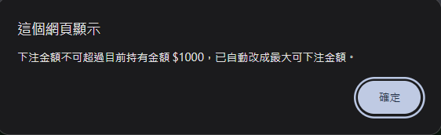

### ✔ Buttons enabled/disabled properly:
- Deal disabled during an active round  
- Hit/Stand disabled after the round completes  

### ✔ Game Over handling:
If money <= 0:
- Alerts user  
- Deal disabled  
- Must press Reset  

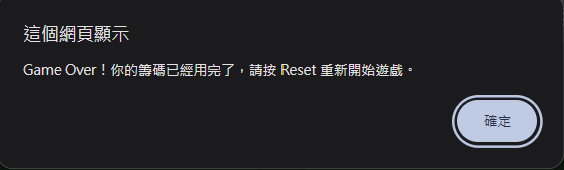
---

# 7. Round Flow 

1. Enter bet → press **Deal**  
2. Player receives 2 cards  
3. Dealer shows 1 card  
4. Player chooses Hit/Stand  
5. Dealer reveals and auto-plays with fixed rules  
6. Compare hands  
7. Player money updated  
8. May start a new round if money > 0  

---

# 8. **Cheat Mode** 

## 8.1 How to enable Cheat Mode
Player clicks **CHEAT** during a round (after Deal).

If pressed too early, the system alerts the user:
> “請先輸入下注金額，並按下 Deal 開始新的一局。”

When activated:
- A **CHEAT ON** indicator appears  
- A log message records the activation  
- A boolean `cheatOn = true` triggers special dealer behavior  

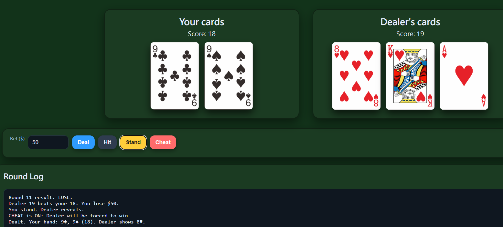
---

## 8.2 Cheat Mode Logic (Dealer Always Tries to Win)

In Cheat Mode:
- Dealer no longer follows the normal 17+ stand rule
- Instead, the dealer looks ahead in the deck and tries to obtain:
  - A hand **strictly higher** than the player  
  - But **≤ 21**  

The dealer may draw cards until reaching a winning total.  
If no winning combination is possible, the dealer still tries to “optimize” the result.

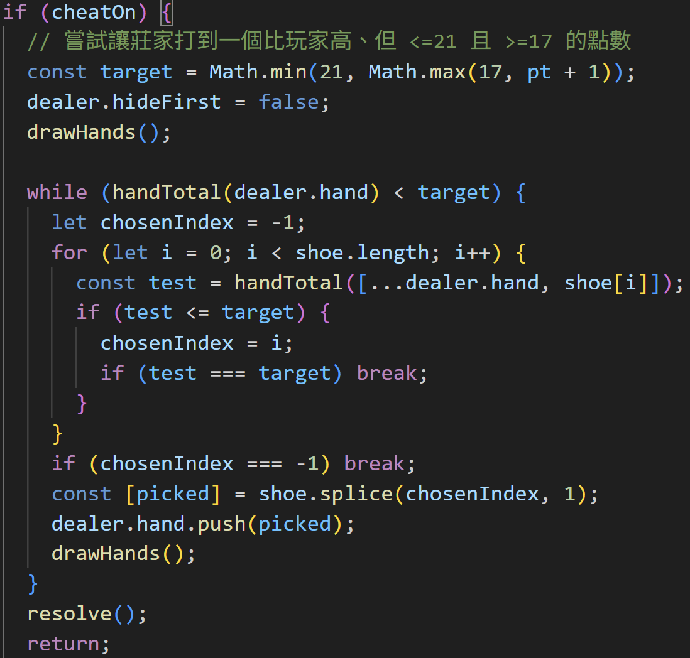
---

## 9. Display Stored Data

This game provides a Display Stored Data button that allows the player to view saved information stored in the browser, including both localStorage and sessionStorage data.

### ✔ LocalStorage
Used to store information that remains across game rounds, such as:

- **Money After**：The player’s money after each round
- **Round**：Round of the game
- **Duration (s)**:Play time
- **Pts (You)**:The player’s points of each roun
- **Pts (Dealer)**:The dealer’s points of each round

These values remain available even after refreshing or reopening the page.

### ✔ SessionStorage 
Used to store data only for the current browsing session, including:

- **lastAction**：上一個動作（Hit / Stand / Deal）  
- **cheatOn**：是否啟用 Cheat Mode  
- **currentBet**：此局下注金額  

All session data is cleared automatically when the page is closed.

### 📌 按鈕功能說明

When the player clicks:

```
Display Stored Data
```

the system will:

1. Read all values from localStorage and sessionStorage
2. Format the data into JSON-style strings

This allows players to quickly check the current game state and stored information.

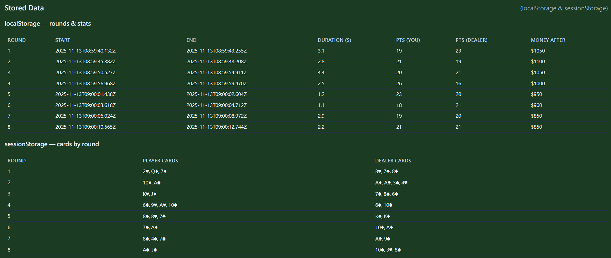

### 📌 對應程式碼

```javascript
document.getElementById("displayDataBtn").addEventListener("click", () => {
  const local = JSON.stringify(localStorage, null, 2);
  const session = JSON.stringify(sessionStorage, null, 2);
  alert("LocalStorage:\n" + local + "\n\nSessionStorage:\n" + session);
});
```

# 10. How to Run the Project

1. Ensure the following files exist:
   - `index.html`
   - `index_style.css`
   - `index_script.js`
   - `poker/` folder containing all card images  
2. Open **index.html** in a modern browser  
3. Follow UI instructions to play  
4. Use **Reset** to restart the money and clear data  

---

# ✔ End of README.md
