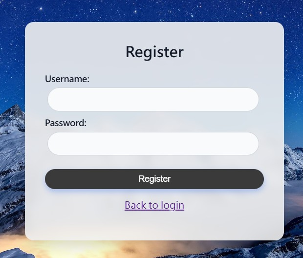
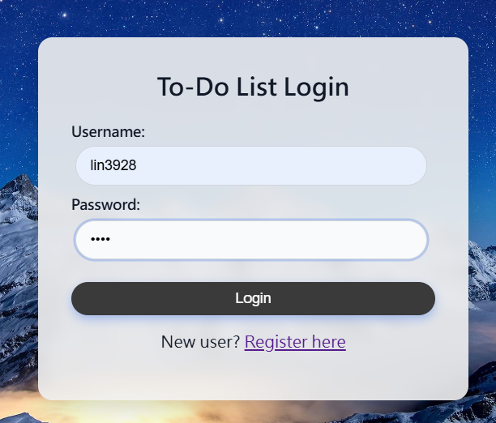
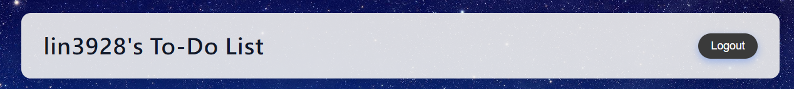
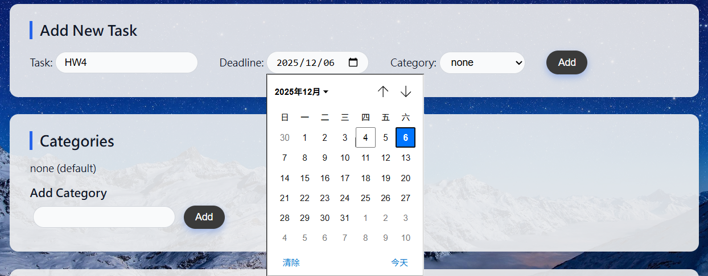
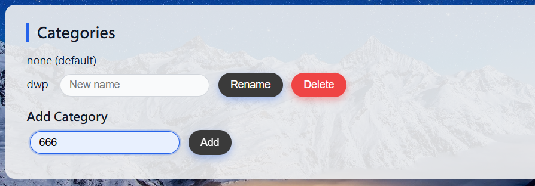
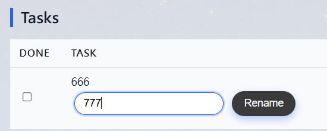
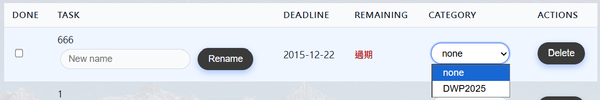
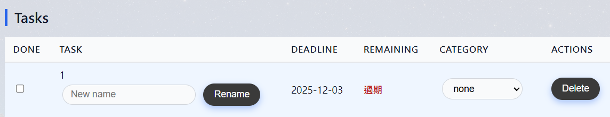
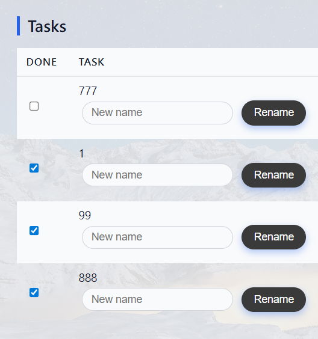
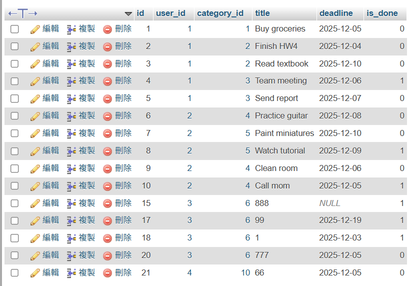

# HW4 — To-Do List Website
## 111550005 林均豪

---

## Basic Requirements

### 1. registration page

---

### 2.  login page

---

### 3.  logout button in the to-do list pages

---

### 4. Add a new task, deadline and select the to-do category

---

### 5. Add a new category 

---

### 6. Change the name of the task 

---

### 7. Change the category of the task

---

### 7. Change the name of the category

---

### 8. Delete the task

---

### 9. Delete the category and the tasks of this category

---

### 10. Use checkbox (or other methods) to show if the task is finished

---

### 11.  Save the data to database after each modification

---

